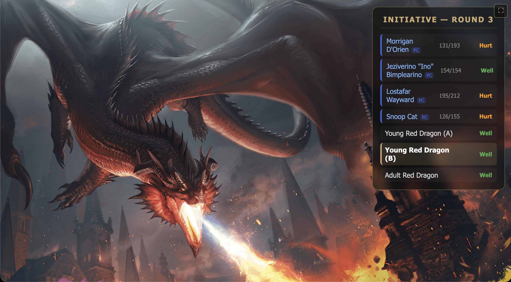
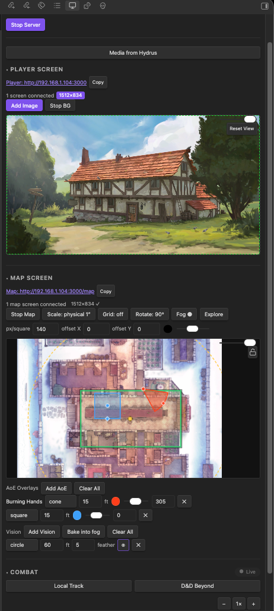
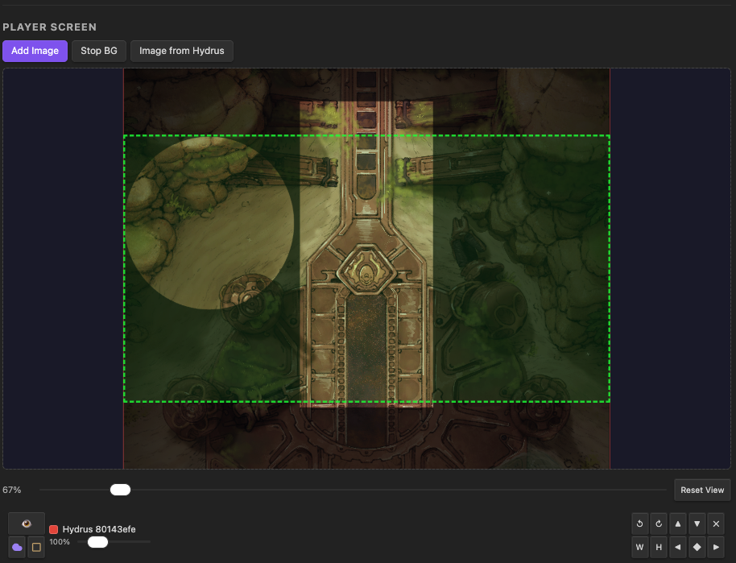
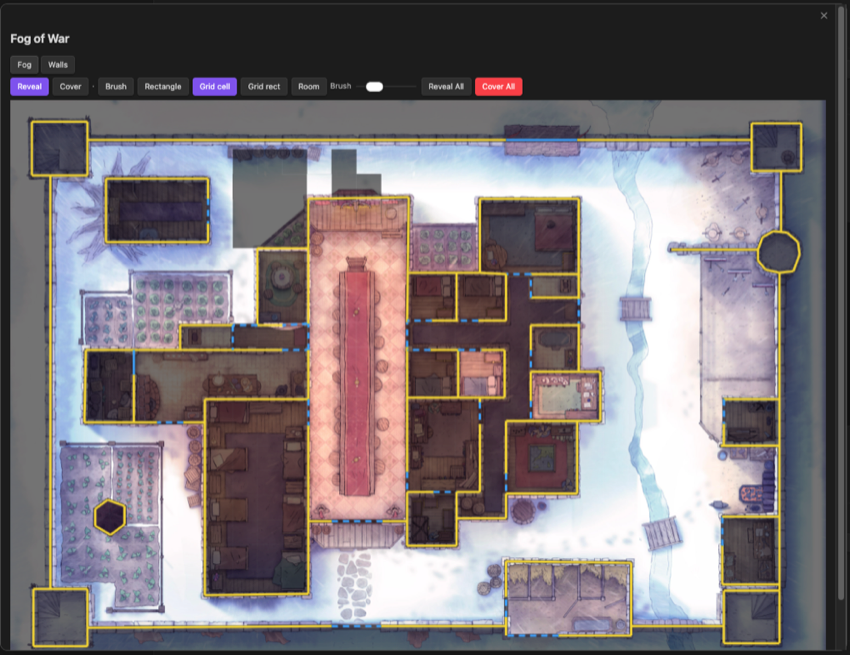
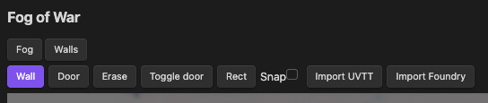
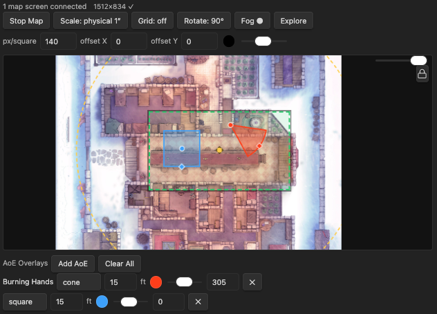
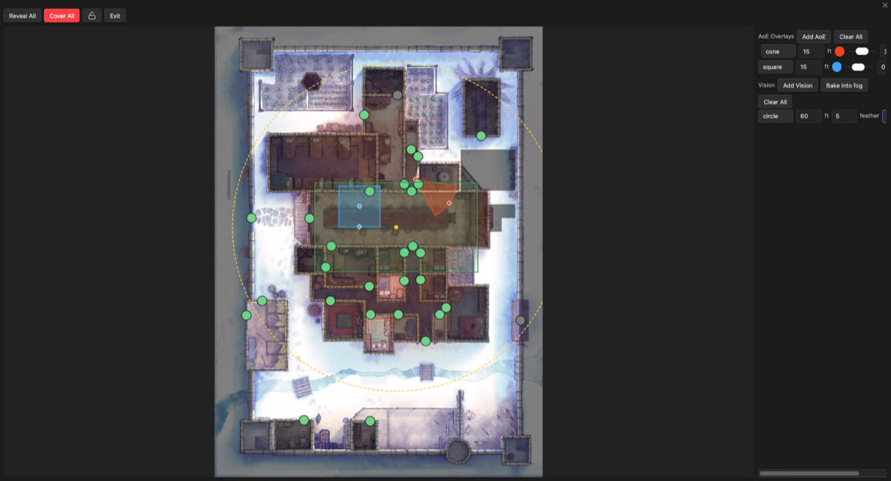
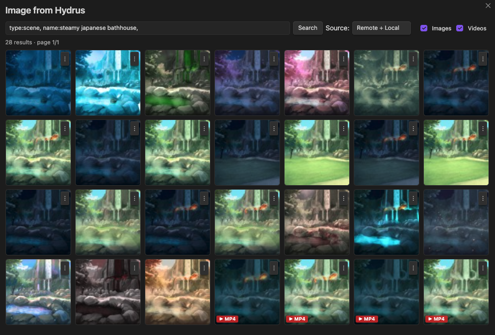
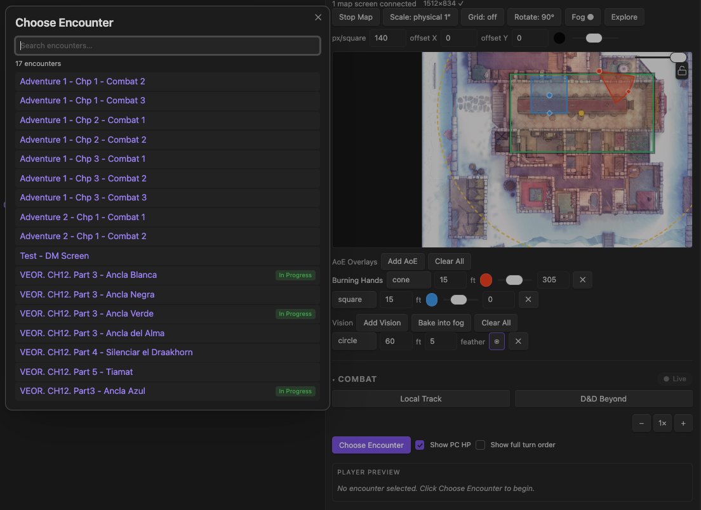

# DM Screen

> Player screen and battle screen for in-person D&D 5e sessions, powered by Obsidian.

DM Screen turns Obsidian into a local control center for tabletop play: it serves a live player screen to any browser on your network — TV, tablet, second monitor — and pushes what your party should see while you keep your notes on the DM side.

Built for in-person 5e games where the DM wants a clean visual layer for the players (maps, portraits, video backgrounds, an initiative tracker) without leaving Obsidian.

## Features

- **Player screen on any device** — HTTP + WebSocket server. Open the URL on a TV, tablet, or second monitor; auto-reconnect handles bumps.
- **Image layers with per-layer fog of war** — stack maps and portraits, fog each layer independently, reveal as combat unfolds.
- **Background image or video** — full-screen scene from the active note, the Hydrus library, or a video loop.
- **Initiative tracker** — manual, synced from the Initiative Tracker plugin, or live from a D&D Beyond encounter.
- **Statblock display** — inline 5e statblocks via Fantasy Statblocks.
- **Multi-screen aware** — multiple connected players with per-client resolution detection.
- **Map screen for TV tables** — a dedicated `/map` endpoint renders one battlemap (image or animated video) at true 1-inch-per-square physical scale for miniatures on a horizontal TV: per-screen calibration with a ruler test pattern, DM-side panning, fit/physical toggle, and an optional grid overlay for gridless maps.
- **Battlemap fog of war** — paint a persistent fog mask over any map with brush / rectangle / grid-cell / whole-room tools; it is saved per map (note images and Hydrus files alike) and re-applied whenever you push the same map again.
- **Dynamic vision & line of sight** — drop feathered vision shapes measured in feet, define walls and doors, and the fog carves out exactly what a token can see; opening a door lets sight spill through.
- **Import walls automatically** — load line-of-sight and doors from a UVTT file (`.dd2vtt` / `.uvtt`) or a Foundry VTT module `.zip` (Czepeku and friends), so you skip drawing walls by hand.
- **Spell AoE overlays** — drop circle / square / cone / line / ring templates (or search the 5e spell catalog) at true grid scale, drag to place, rotate to aim.
- **Exploration Mode** — a near-fullscreen table-play surface: click doors to open/close them and rooms to reveal/hide their fog, drag the players' viewport, and bind a vision to follow the view for a moving "torchlight" as the party explores.
- **Send layer to webhook** — right-click an image layer to POST it to Telegram, Discord, or any `multipart/form-data` endpoint with an editable caption.

*Player-screen fog of war is drawn per image layer with reveal / fog circle, rectangle, and freehand tools. The map screen has its own, richer fog system — see [Battlemap fog of war, walls, and vision](#battlemap-fog-of-war-walls-and-vision).*

## Quickstart

1. Install and enable the plugin (see [Installation](#installation)).
2. Open the **DM Control Panel** from the ribbon icon or the Command Palette ("Open DM Control Panel").
3. Click **Start Server**. The panel shows a LAN URL — open it on the device your players will look at.
4. Use **Add Image** to push images from the active note, **Add BG** to set a background, or **Media from Hydrus** to browse your Hydrus library.
5. In the COMBAT section, pick a source (Manual, Initiative Tracker plugin, or D&D Beyond) and start the encounter.

## Map screen (TV tables)

A second endpoint dedicated to battlemaps for in-person play with miniatures on a horizontal TV. It is fully independent from the player screen: clearing one never touches the other, and both can run at the same time on different devices.

**Setup**

1. With the server running, open `http://<lan-ip>:<port>/map` on the table TV (the MAP SCREEN section in the DM panel shows the exact URL). Use the on-screen button to go fullscreen.
2. The TV appears as a resolution badge in the panel. Click it and enter the screen's physical **diagonal in inches**; toggle the **test pattern** (a 6-inch ruler and a 1-inch square rendered on the TV) and fine-tune until a real ruler agrees. The calibration is stored per resolution and reused forever.
3. Click **Add Map** — same sources as the background: images embedded in the active note and `hydrus://` references (images or videos, so animated maps just work). The Hydrus explorer also has a **Set as map** action.

**At the table**

- **Scale toggle** — *fit screen* shows the whole map (exploration); *physical 1″* renders every grid square as exactly one real inch, so miniatures sit true to RAW scale.
- **Pan** — in physical mode most maps overflow the TV; drag the green rectangle on the panel's preview (or click anywhere in it) to choose the visible window.
- **Rotate** — 90° steps. In fit mode a portrait map turned sideways uses the whole landscape TV.
- **Grid overlay** — for gridless map variants: a lattice drawn over the map, aligned to its cells. `px/square` is how many map pixels one square spans (Czepeku full-resolution exports are 140; the default for new maps is configurable in settings). `offset X/Y` shift the lattice's phase in map pixels for maps whose grid doesn't start at the image corner. Line color and opacity are adjustable.
- Everything — scale mode, pan, rotation, grid — is remembered **per map** and restored when you push the same map again.

If the TV isn't calibrated yet, physical mode falls back to 96 px/inch and both the TV and the panel show a warning until you calibrate.

### Battlemap fog of war, walls, and vision

*The Fog editor: reveal / cover with brush, rectangle, grid-cell, and whole-room tools, plus a Walls tab for line of sight.*

While a map is active, the MAP SCREEN section gains a **Fog** button (it reads `Fog ●` once a map has fog). It opens a dedicated editor with two tabs:

- **Fog tab** — a single mask over the map: black hides, transparent reveals. Paint with a sized **brush**, a **rectangle** marquee, a snapped **grid cell** or **grid rectangle**, or the **Room** tool (one click floods a whole walled room). Reveal and Cover are the two modes; **Reveal All** / **Cover All** reset the whole map. The mask is saved as a sidecar next to nothing you have to manage — it lives in `.dm-screen/fog/`, keyed to the map, and comes back whenever you show that map again (note images and Hydrus-cached files alike). TV opacity of the fog layer is adjustable in settings.
- **Walls tab** — draw line-of-sight **walls** and **doors** (chained clicks or a rectangle drag), toggle a door open/closed, or erase. Walls power dynamic vision and the Room flood.

**Dynamic vision** lives in its own panel section: add a **Circle** or **Square** vision (range in feet, with a soft feather), drag it onto a token, and the fog carves out exactly what it can see. Where walls block the line of sight the reveal stops at the wall; an **open door** lets vision spill through while a closed one blocks it. **Bake into fog** burns the current vision permanently into the mask (for "we've explored this" areas) and clears the live layer.

**Importing walls** — drawing walls by hand is optional. On the Walls tab:

- **Import UVTT** — load a `.dd2vtt` / `.uvtt` / `.df2vtt` export (Dungeondraft and most VTT map packs). Walls, objects, and portals become walls and doors, and the map's grid size is set automatically.
- **Import Foundry** — load a Foundry VTT module `.zip` (the format Czepeku and other creators ship). The scene's walls and doors are extracted and scaled to your map. Both old (NeDB) and new (LevelDB) Foundry module layouts are supported.

### Spell AoE overlays

*Templates render at true grid scale (1 square = 5 ft) on both the panel preview and the TV.*

The **AoE Overlays** section drops spell templates onto the map: **Circle**, **Square**, **Cone**, **Line**, and **Ring** presets, or a **Spells…** search over the 5e catalog that pre-fills the shape, size, and color for a chosen spell. Set size (and width, for lines and rings), color, opacity, and rotation per template; drag the anchor dot on the preview to place it and the diamond handle to aim it. AoEs are ephemeral combat state — they clear when you stop the map.

### Exploration Mode

*A table-play surface for running the map live: toggle doors and rooms, move the players' view, and light the way.*

The **Explore** button opens a near-fullscreen surface built for running the session, not editing it:

- **Click a door** to open or close it — green means open, grey means closed. The players' TV recomputes line of sight instantly.
- **Click a room** to reveal or hide its fog in one gesture; a green hover highlight shows which room you're about to toggle. Doors always bound a room here, so an open door lights up without merging rooms.
- **Move the players' view** — in physical mode, drag the viewport rectangle to pan what the table sees. A **lock** button freezes it so you can't nudge it by accident; hold **Shift** to momentarily click straight through to doors and rooms without moving anything.
- **Bind a vision to the view** — flip the ⦿ toggle on a vision and its lit circle/square follows the players' viewport as you pan, a moving pool of light that makes exploration feel alive.
- A side panel carries the full **AoE and Vision** controls, so you can add, tweak, and place templates without leaving the modal.

Everything here reuses the same fog, walls, and vision the editor produced — Exploration Mode is where you *drive* them at the table.

## Installation

### BRAT (recommended)

DM Screen is not yet listed in the Obsidian Community Plugins gallery. The easiest install path is [BRAT](https://github.com/TfTHacker/obsidian42-brat):

1. Install BRAT from Community Plugins.
2. Add this repository: `hbermu/obsidian-dm-screen`.
3. BRAT keeps you on the latest release automatically.

### Manual

Download `main.js`, `manifest.json`, and `styles.css` from the [latest release](https://github.com/hbermu/obsidian-dm-screen/releases) and drop them into `.obsidian/plugins/dm-screen/`.

## Integrations

### Hydrus Network

Browse a self-hosted [Hydrus](https://hydrusnetwork.github.io/hydrus/) media library by tags and push files to the player screen.

- Click **Media from Hydrus** in the DM Control Panel to open the explorer.
- Left-click a tile to open a full-resolution preview with action buttons (add as image layer, set as background, set as map, copy tags, copy reference).
- Right-click a tile — or use its ⋮ button — for the same actions as a context menu, plus cache management (download / delete local copy).
- Videos can be used as a background or map, not as an image layer.
- Downloaded media is cached locally; the cache folder, retention, and tag filters are all configurable in settings.

### D&D Beyond

Sync live encounters from your [D&D Beyond](https://www.dndbeyond.com) account so the player screen reflects the real-time state of combat.

To set it up:

1. Enable D&D Beyond integration in settings.
2. Log in to [dndbeyond.com](https://www.dndbeyond.com) in your browser and copy your `CobaltSession` cookie (DevTools → Application → Cookies → dndbeyond.com).
3. Paste it into the settings field and click **Test connection**.
4. In the DM Control Panel's COMBAT section, switch to the **D&D Beyond** tab and pick an encounter. Initiative, HP, and monster avatars start streaming to the player screen automatically.

### Webhook share (Telegram, Discord, …)

Right-click any image layer in the DM Control Panel → **Send to image webhook…** → pick a target, edit the caption (defaults to the layer's label), hit Send. Anything that accepts a `multipart/form-data` upload works:

- **[Telegram](https://core.telegram.org/bots/api#sendphoto) bot** — `sendPhoto` against a chat your bot is in, with the caption riding along.
- **[Discord](https://discord.com/developers/docs/resources/webhook#execute-webhook) webhook** — drops the image into a channel; the caption becomes the message body.
- **Generic** — anything else; you spell out the image field name, caption field name, and any extra static form fields (tokens, IDs, etc.).

To set it up:

1. Open **Settings → DM Screen → Webhooks**.
2. Click **Load template ▾** and pick **Telegram bot**, **Discord webhook**, or **Generic multipart** to drop in starter values.
3. Replace the placeholders in the URL (`<TOKEN>`, `<CHAT_ID>`, `<ID>`) with the real credentials from your bot or channel. URL fields render in plain text so you can copy them out to an external editor when fiddling with long bot URLs.
4. Right-click an image layer → **Send to image webhook…**, confirm, send.

Fog of war is never composited onto the outbound image — what the layer originally is, is what gets sent.

## Configuration

Open **Settings → DM Screen**. The tab is split into five sections — Server, Hydrus Library, D&D Beyond, Webhooks, and Advanced — each with inline descriptions for every option. Most defaults are fine for a first run; you only need to revisit settings when you plug in Hydrus, D&D Beyond, or a webhook target.

## Compatible plugins

DM Screen integrates with two community plugins when they are installed and enabled:

- [Initiative Tracker](https://github.com/javalent/initiative-tracker) — auto-syncs combatants, HP, statuses, and rounds.
- [Fantasy Statblocks](https://github.com/javalent/fantasy-statblocks) — inline 5e statblock display in the DM combat panel.

## Network usage & privacy

DM Screen is a **desktop-only** plugin that starts a local HTTP + WebSocket server on your machine:

- **Player screen server** — listens on a configurable port (default `7070`) on all network interfaces (`0.0.0.0`). Any device on the same LAN can connect; there is no authentication layer (by design — it's meant for the same room).
- **Hydrus Network** (optional) — connects to your self-hosted Hydrus Client API (`http://localhost:45869` by default) to search and download images. No data leaves your LAN.
- **D&D Beyond** (optional) — polls the D&D Beyond encounter API to sync combatants and HP. Requires a session cookie you provide; no credentials are stored beyond what you paste into settings.
- **Webhooks** (optional) — POSTs image layers to endpoints you configure (Telegram, Discord, custom). Only triggered explicitly by the user via the "Send to webhook" action.

The plugin does not collect telemetry, phone home, or transmit any data to third parties without explicit user action. All cached files (Hydrus images, D&D Beyond avatars) are stored locally inside your vault.

## Support & contributing

- Found a bug or want to request a feature? [Open an issue](https://github.com/hbermu/obsidian-dm-screen/issues).
- Contributing? Start with [AGENTS.md](AGENTS.md) for build, test, branch, and release conventions.

## License

[MIT](LICENSE)
